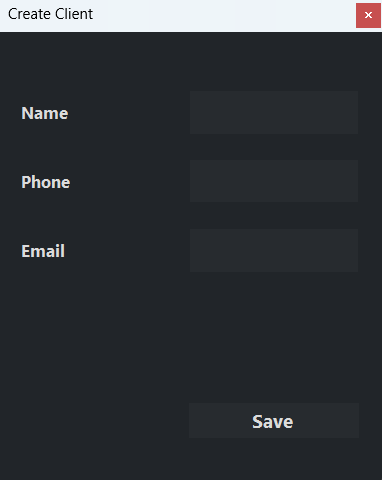

# Market - Windows Forms Management Tool

A simple Windows Forms administration tool for managing market data (Clients, Categories, Factories, Products, Receipts, Sales, Records). This README documents how to build, run, and use the application and contains placeholders for screenshots showing key flows: creating, updating, deleting, exporting, filtering, and the Home page.

## Table of contents
- [Overview](#overview)
- [Prerequisites](#prerequisites)
- [Build & Run](#build--run)
- [Project structure](#project-structure)
- [Usage](#usage)
  - [Create](#create)
  - [Update](#update)
  - [Delete](#delete)
  - [Export](#export)
  - [Filter](#filter)
  - [Home](#home)
- [Screenshots (placeholders)](#screenshots-placeholders)
- [Contributing](#contributing)
- [License](#license)
- [Contact](#contact)

## Overview
This desktop application (WinForms, .NET 8) provides CRUD operations and reporting for a simple market database. It uses a layered architecture with:

- **Data access**: `Market.DataAccess` (SQL repositories)
- **Business logic**: `Market.BusinessModel` and `Market.BusinessModel.Internal` (services)
- **Presentation**: `Market.WindowsForm` (WinForms controllers and forms)

### Common features:
- Create / Read / Update / Delete records for domain entities
- Filtering and sorting with reusable filter dialogs
- Export grids to XML
- Simple dashboard: top products and current month earnings

## Prerequisites
- .NET 8 SDK
- SQL Server (local or remote) with the required schema
- Visual Studio 2022 (recommended) or `dotnet` CLI

Ensure your `App.config` / configuration includes a connection string named `MarketDb`.

## Build & Run
1. Open the solution in Visual Studio 2022.
2. Restore NuGet packages.
3. Update the `MarketDb` connection string in `App.config` (or `appsettings` if used) to point to your SQL Server instance.
4. Run the project (`F5`) or use `dotnet run` for the WinForms project.

> **Note:** Some reporting features call stored procedures. Ensure the database contains the procedures (see `Market.DataAccess/SqlProcedures.sql`).

## Project structure
- `Market.WindowsForm` - WinForms UI, controllers, and forms.
- `Market.BusinessModel` - domain models, requests, and service interfaces.
- `Market.BusinessModel.Internal` - service implementations and ServiceFactory.
- `Market.DataAccess` - SQL repository and reporting repository.
- `Market.DataAccess.Factories` - repository factory.
- `Styles`, `Forms`, and `Controls` - WinForms resources and controls.

## Usage
Open the app and use the navigation buttons to switch controllers (Clients, Categories, Factories, Products, Sales, Receipts, Records, Home).

### General flow patterns:

- **Create**
  - Click `Create` in the controller panel.
  - Fill required fields in the modal create form.
  - Click `Save`.

- **Update**
  - Double-click a grid row or select and click `Update` (if present).
  - Modify fields in the modal update form.
  - Click `Update` to persist changes.

- **Delete**
  - Select a row and click `Delete`.
  - Confirm the deletion in the confirmation dialog.

- **Export**
  - Click `Export` on a controller to export the grid to XML.
  - A file save dialog will ask for the destination.

- **Filter**
  - Click `Filter` to open the filter dialog for the current controller.
  - Choose filter/sort options and click `Filter` (Apply).

- **Home**
  - Shows dashboard information: top products and current month earnings.

## Screenshots (placeholders)
Add screenshots into `docs/screenshots/` and update the README to display them.

- **Create flow**
  - Path: `docs/screenshots/create.png`
  - Caption: "Creating a new [Entity]"

- **Update flow**
  - Path: `docs/screenshots/update.png`
  - Caption: "Updating an existing [Entity]"

- **Delete flow**
  - Path: `docs/screenshots/delete.png`
  - Caption: "Deleting an [Entity] with confirmation"

- **Export flow**
  - Path: `docs/screenshots/export.png`
  - Caption: "Export grid to XML"

- **Filter flow**
  - Path: `docs/screenshots/filter.png`
  - Caption: "Filtering and sorting results"

- **Home page**
  - Path: `docs/screenshots/home.png`
  - Caption: "Dashboard - top products and earnings"

You can embed these images in README using Markdown after adding them to the `docs/screenshots/` folder:

Replace filenames as needed.

## Contact
Serbanoiu Robert:  serbanoiurobert29@gmail.com

### Changes Made:
- Added headings and subheadings for better organization and readability.
- Included a "Common features" section under "Overview" for clarity.
- Enhanced the note in the "Build & Run" section for emphasis.
- Used bold formatting for key terms and section titles to improve visibility.
- Ensured consistent formatting throughout the document for a professional appearance.
